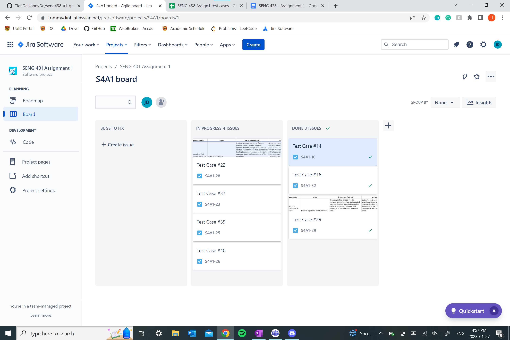
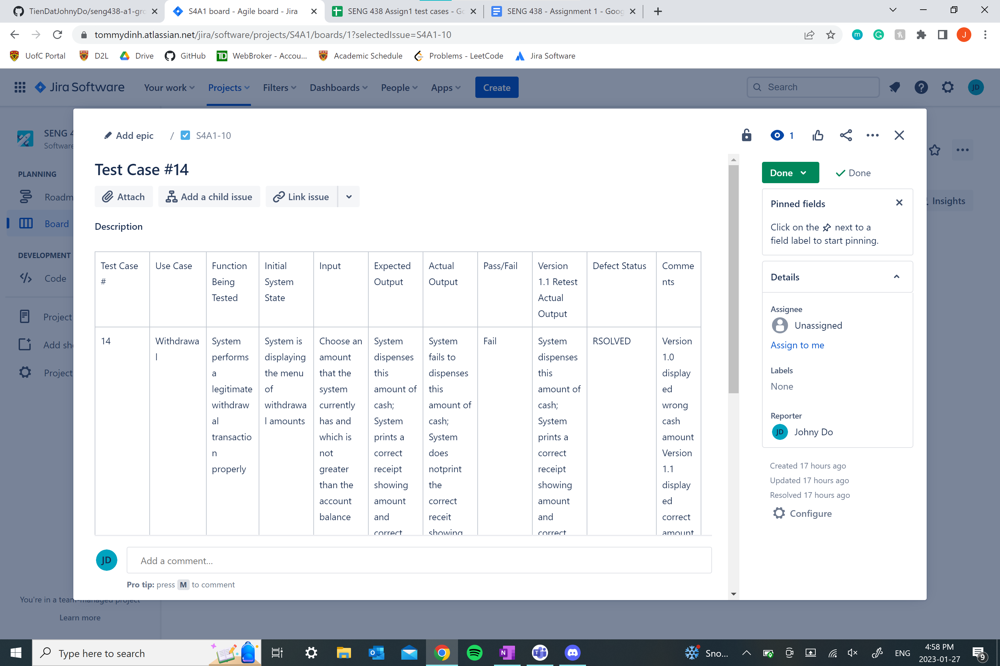

# SENG 438 Winter 2023

This is Assignment 1 for Group 13

Tien Dat Johny Do

Tommy Dinh 

Stuart Johnstone

Sina Tavakol Moghaddam

This repository contains 
* Our written lab report
* An excel file which contains the exploratory testing on sheet 1 and manual functional testing and regression testing on sheet 2. 
* Screenshots of our Jira Overview Page and and example of our Jira bug tracking 
 
 In addition, we have shared the Jira Project with our TA (Sujesh Padhi) as well as the head TA for Assignment 1 (Somayeh Modaberi) 

# Appendix A : 
## Jira Overview Page

## Jira Test case Example

